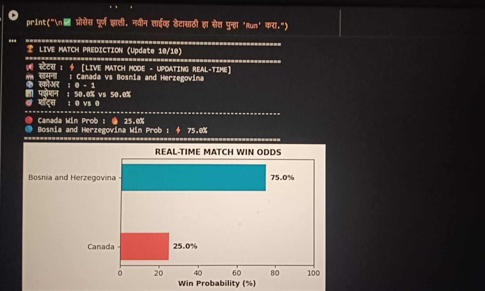

# Project Name: Live Match Probability Predictor
# Description: A Python-based project that tracks live football match odds using real-time data. This specific project tracks the Canada vs Bosnia and Herzegovina match.
# Key Skills: Python, Data Visualization, Real-time Data Acquisition, API Integration.
### Match Analysis Graph

